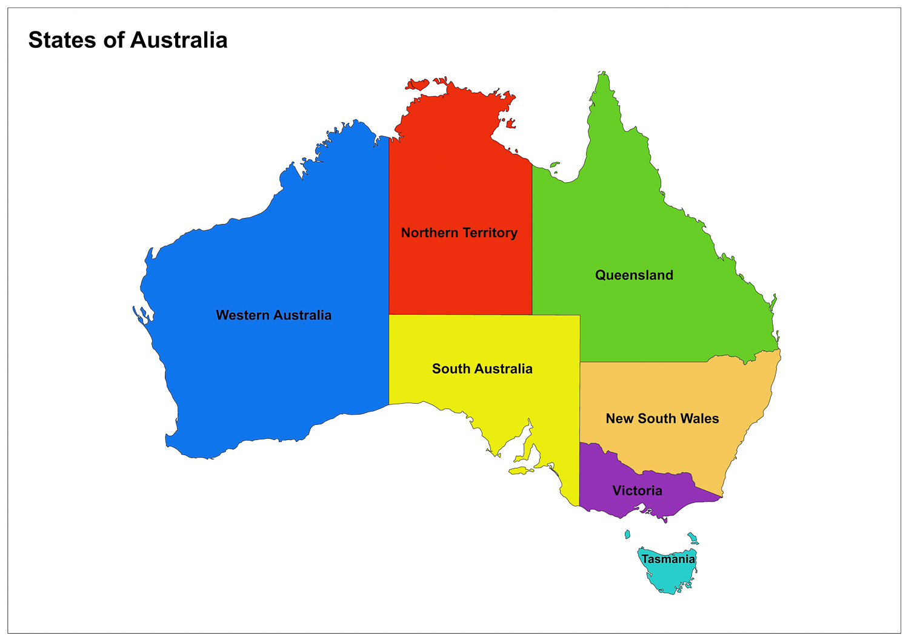
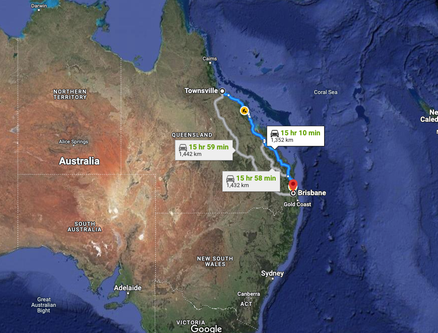

### Introduction

The Royal Society for the Prevention of Cruelty to Animals, or RSPCA, is Australia's oldest, largest and most trusted animal welfare organisation. In the year of 2020 alone they received over 1 million animals into their shelters and adoption centres across the country. Through hard work and concerted efforts, they have managed to increase their rates of adoption and reclaiming, improving the outcomes for hundreds of thousands of cats and dogs, who have either been reunited with their owners or have found a new home.

In this presentation, I will answer questions that the RSPCA has asked for the purposes of gaining more insight into the animals, especially the cats and dogs, of Australia. This will help them make more informed decisions in the future through the power of data, with the goal of further increasing their rates of adoption and reclaiming. I believe my analysis will help the RSPCA move forward in their goal and improve animal welfare across Australia as a whole.


### The Data

For this project, I was given three sources of data. The first is from the open RSPCA database and covers Australia as a whole, divided into regions. It looks at the outcomes for cats, dogs and other animals the RSPCA has received into its care (i.e, whether they were rehomed, euthanised, still in stock and so on), with data spanning from 1999 to 2018. The data is from a trusted source and is of high quality.

Here is a map of Australian states for reference:



The next two sources I was given concern data specific to Townsville and Brisbane, two large Australian cities.

Townsville is a city on the north-eastern coast of Queensland, Australia. With a population of 180,000, it is the largest settlement in North Queensland; it is unofficially considered the capital of North Queensland. 

Brisbane is the official capital of Queensland, and is about 1000km South East of Townsville, in the centre of South East Queensland. It's population is about 2.6 million. 
Both datasets consists of data gathered by their respective councils, and concern the volume and type of animal complaints received overtime. This is further broken by suburb. Both these datasets come from local councils and are trusted sources. Here's another map showing the location of both of these cities:



### Business Questions

Here are the business questions I have been tasked with investigating:

Is there are a trend in injuries By Region, and is there different peaks of times of year per region?

Analysis on the types of animals that are injured, this also by Region – is there a species that is more liable to injury in certain regions?

What is the outcome? Does this differ by region?

Total call volume for complaint calls: How has this trended over time?
Is there a particular animal being called about the most?
Do particular suburbs have different type of complaint calls? Do they call about different animals?

Business Intelligence – using the insights you have found, can you predict how this might look for the upcoming year?


### Analysis

First, I looked at the total call volume for complaint calls, to see how this trended over time. 

```{r, echo=FALSE, message=FALSE, error=FALSE, eval=FALSE}
library(tidyverse)
library(ggthemes)
source("cleaning_script.R")
```

```{r, echo=FALSE, message=FALSE, error=FALSE, eval=TRUE}
animal_complaints %>% 
  group_by(date_received) %>% 
  summarise(count = n()) %>% 
  ggplot() +
  aes(x = date_received, y = count) +
  geom_line(col = "blue") +
  scale_x_date(date_breaks = "6 months", date_labels = "%b %y") + 
  labs(title = "Townsville Complaint Calls",
       x = "Time",
       y = "Number of Calls") +
  theme_economist() +
  theme(axis.text.x = element_text(angle = 45, vjust = 1, family = "mono", face = "bold", size = 7),
        axis.title.y = element_text(vjust = 3.2),
        title = element_text(family = "mono", face = "bold"),
        plot.title = element_text(hjust = 0.4)) +
        annotate("rect", xmin = as.Date("2014-06-01"), xmax = as.Date("2014-08-01"), ymin = -Inf, ymax = Inf, fill = "gray70", alpha = 0.3) +
        annotate("rect", xmin = as.Date("2015-06-01"), xmax = as.Date("2015-08-01"), ymin = -Inf, ymax = Inf, fill = "gray70", alpha = 0.3) +
        annotate("rect", xmin = as.Date("2016-06-01"), xmax = as.Date("2016-08-01"), ymin = -Inf, ymax = Inf, fill = "gray70", alpha = 0.3) +
        annotate("rect", xmin = as.Date("2017-06-01"), xmax = as.Date("2017-08-01"), ymin = -Inf, ymax = Inf, fill = "gray70", alpha = 0.3) +
        annotate("rect", xmin = as.Date("2018-06-01"), xmax = as.Date("2018-08-01"), ymin = -Inf, ymax = Inf, fill = "gray70", alpha = 0.3) +
        annotate("rect", xmin = as.Date("2019-06-01"), xmax = as.Date("2019-08-01"), ymin = -Inf, ymax = Inf, fill = "gray70", alpha = 0.3)


labels <- c("Q1 2016", "Q2 2016", "Q3 2016", "Q4 2016", "Q1 2017", "Q2 2017", "Q3 2017", "Q4 2017", "Q1 2018", "Q2 2018", "Q3 2018", "Q4 2018", "Q1 2019", "Q2 2019", "Q3 2019", "Q4 2019", "Q1 2020", "Q2 2020")

brisbane_complaints %>% 
  group_by(date) %>% 
  summarise(count = n()) %>% 
  ggplot(aes(x = date, y = count)) +
  geom_point() +
  geom_line(col = "blue") +
  scale_x_date(date_breaks = "3 months", date_labels = labels, expand = c(0,0)) +
  labs(title = "Brisbane Complaint Calls",
       x = "Time",
       y = "Number of Calls") +
  theme_economist() +
  theme(axis.text.x = element_text(angle = 50, vjust = 0.8, family = "mono", face = "bold", size = 7),
        axis.title.y = element_text(vjust = 3.2),
        title = element_text(family = "mono", face = "bold"),
        plot.title = element_text(hjust = 0.4))


```


As you can see looking at these graphs, there is a noticeable seasonality. This can clearly be seen in the Townsville graph, with calls peaking around July/August, which is winter for Australia. For Brisbane, which is broken down by quarter rather than month, there does appear to be seasonality but it is less pronounced and we do not have enough data to say this definitively.

So there is evidence of seasonality, but I was also interested to investigate the average overtime in general. Here is some graphs which show this:

```{r, echo=FALSE, message=FALSE, error=FALSE, eval=TRUE}
animal_complaints %>% 
  group_by(date_received) %>% 
  summarise(count = n()) %>% 
  ggplot(aes(x = date_received, y = count)) +
  geom_smooth() +
  geom_point() +
  scale_x_date(date_breaks = "1 year", date_labels = "20%y") +
  labs(title = "Townsville Complaint Calls",
       x = "Time",
       y = "Number of Calls") +
  theme_economist() +
  theme(axis.text.x = element_text(vjust = 1, family = "mono", face = "bold"),
        axis.title.y = element_text(vjust = 3.2),
        title = element_text(family = "mono", face = "bold"),
        plot.title = element_text(hjust = 0.4))
```


```{r, echo=FALSE, message=FALSE, error=FALSE, eval=TRUE}
brisbane_complaints %>% 
  group_by(date) %>% 
  summarise(count = n()) %>% 
  ggplot(aes(x = date, y = count)) +
  geom_point() +
  geom_smooth() +
  scale_x_date(date_breaks = "1 year", date_labels = "20%y") +
  labs(title = "Brisbane Complaint Calls",
       x = "Time",
       y = "Number of Calls") +
  theme_economist() +
  theme(axis.text.x = element_text(vjust = 1, family = "mono", face = "bold"),
        axis.title.y = element_text(vjust = 3.2),
        title = element_text(family = "mono", face = "bold"),
        plot.title = element_text(hjust = 0.4))
```

With these graphs, we can see more clearly the general trend, ignoring seasonality. For Townsville, there is a steady increase up to 2017 and then a steady decline, to a similar place to where the number of calls started.

For Brisbane, we can see a more clear trend upward over time, though there is only 4 years of data. This means any conclusions to be drawn from this should be taken with a grain of salt. 


Next, I looked at which animals were being called about the most. Again, I looked at both cities, and this time the conclusion was much more clear.

```{r, echo=FALSE, message=FALSE, error=FALSE, eval=TRUE}
animal_complaints %>% 
  group_by(animal_type) %>% 
  ggplot(aes(x = animal_type)) +
  geom_bar(col = "blue", fill = "blue") +
  labs(title = "Townsville Complaints by Animal",
       x = "Type of Animal",
       y = "Number of Complaints") +
  theme_economist() +
  theme(axis.text.x = element_text(vjust = 1, family = "mono", face = "bold"),
        axis.title.y = element_text(vjust = 3.2),
        title = element_text(family = "mono", face = "bold"),
        plot.title = element_text(hjust = 0.4))

brisbane_complaints %>% 
  group_by(type_of_animal) %>%
  ggplot(aes(x = type_of_animal)) +
  geom_bar(col = "blue", fill = "blue") +
  labs(title = "Brisbane Complaints by Animal",
       x = "Type of Animal",
       y = "Number of Complaints") +
  theme_economist() +
  theme(axis.text.x = element_text(angle = 40, vjust = 1, family = "mono", face = "bold", size = 6),
        axis.title.y = element_text(vjust = 3.2),
        title = element_text(family = "mono", face = "bold"),
        plot.title = element_text(hjust = 0.4))
```


For Townsville, dogs are responsible for 10x the amount of calls as cats! 

As for Brisbane, cats account for 35% of the calls that concern dogs. In fact, dogs account for half of all calls!

One interesting point is that the numbers for foxes are quite high for a wild animal. This is something that needs further investigation to learn more about.

So, we can see quite clearly that dogs account for the majority of the calls, and overshadow cats in second place by a large margin.


Now we will look at the data broken down by suburb and complaint type. This proved a little more difficult than one might first think. Brisbane has 192 suburbs, while Townsville has 85. I decided to first focus on the Townsville data, and distill the suburbs down to a more reasonable number. I wanted to look at suburbs with a similar amount of complaint calls. I focused on those with less than 500 and more than 100 calls. I decided that any suburb with less than 100 calls would be such a small number my percentages would be skewed, and no valid conclusions could be drawn. 

```{r, echo=FALSE, message=FALSE, error=FALSE, eval=TRUE}
animal_complaints %>% 
  group_by(suburb) %>% 
  summarise(count = n(), complaint_type) %>% 
  filter(count < 500 & count > 100) %>% 
  ggplot(aes(x = suburb, y = count, fill = complaint_type)) +
  geom_col(position = "fill", width = 0.9) +
  coord_flip() +
  labs(title = "Townsville Complaint Types by Suburb",
       x = "Suburb",
       y = "Proportion of Complaint",
       color = "Complaint Type",
       subtitle = "No. of Calls < 500") +
  scale_fill_discrete(name = "Complaint Type") +
  theme_economist() +
  theme(axis.text.x = element_text(vjust = 1, family = "mono", face = "bold", size = 10),
        axis.title.y = element_text(vjust = 3.2),
        axis.text.y = element_text(size = 9, family = "mono"),
        title = element_text(family = "mono", face = "bold"),
        plot.title = element_text(hjust = 0.4, size = 13),
        plot.subtitle = element_text(hjust = 0.4, vjust = 0.01, size = 8),
        legend.text = element_text(size = 8, family = "mono", face = "bold"))
```


So, here I have shown the relative percentages of complaint types for the suburbs. The data has been scaled, so that a suburb with a higher count doesn't skew the data, and we can see proportions.

One thing to note here, is the vast variation in tolerance for noise. Most categories are consistent except this one. Cluden for example has a small percentage of noise complaints, while Bohle Plains has a huge percentage. This requires more investigation to figure out the root cause. 

Looking at the same but in a different way, we get:

```{r, echo=FALSE, message=FALSE, error=FALSE, eval=TRUE}
animal_complaints %>% 
  group_by(suburb) %>% 
  summarise(count = n(), complaint_type, animal_type) %>% 
  filter(count < 500 & count > 100) %>% 
  ggplot(aes(x = complaint_type, y = count, fill = complaint_type)) +
  geom_col(width = 0.8) +
  facet_wrap(~ suburb) +
  labs(title = "Townsville Complaint Types by Suburb - Faceted",
       x = "",
       y = "Number of Calls",
       color = "Complaint Type") +
  scale_fill_discrete(name = "Complaint Type") +
  scale_y_continuous(labels = scales::comma) +
  theme_economist() +
  theme(axis.text.x = element_blank(),
        axis.title.y = element_text(vjust = 3.2),
        axis.text.y = element_text(size = 9, family = "mono"),
        axis.title.x = element_text(vjust = -1),
        title = element_text(family = "mono", face = "bold"),
        plot.title = element_text(hjust = 0.4, size = 12),
        legend.text = element_text(size = 5, family = "mono", face = "bold"),
        legend.title = element_text(size = 6),
        strip.text = element_text(size = 6, family = "mono", face = "bold"))
```

This graph shows the same thing as before but with counts rather than proportions. It allows us to see things in a different way. For example, we can see that Hyde Park has a disproportionate amount of private impounds, while Bohle plains has more noise complaints. This is consistent with the previous graph that showed us proportions, so we can be assured that our analysis is accurate

Looking at another subset of suburbs, this time those with total calls between 500 and 4000, we get this:

```{r, echo=FALSE, message=FALSE, error=FALSE, eval=TRUE}
animal_complaints %>% 
  group_by(suburb) %>% 
  summarise(count = n(), complaint_type) %>% 
  filter(count >= 500 & count <= 4000) %>% 
  ggplot(aes(x = suburb, y = count, fill = complaint_type)) +
  geom_col(position = "fill") +
  coord_flip() +
  labs(title = "Townsville Complaint Types by Suburb",
       x = "Suburb",
       y = "Proportion of Complaint",
       color = "Complaint Type",
       subtitle = "No. of Calls > 500") +
  scale_fill_discrete(name = "Complaint Type") +
  theme_economist() +
  theme(axis.text.x = element_text(vjust = 1, family = "mono", face = "bold", size = 10),
        axis.title.y = element_text(vjust = 3.2),
        axis.text.y = element_text(size = 9, family = "mono"),
        title = element_text(family = "mono", face = "bold", size = 9),
        plot.title = element_text(hjust = 0.4),
        plot.subtitle = element_text(hjust = 0.4, vjust = 0.01),
        legend.text = element_text(size = 8, family = "mono", face = "bold"))
```
What sticks out to me in these busier suburbs, is the variability in private impounds. Aitkenvale, Thuringowa Central and Douglas stand out as being proportionally very high in number of private impounds. More investigation is needed to find out the cause of this.


Now let's look at things broken down by type of animal, rather than complaint type. Looking at the original set of suburbs, we get this:

```{r, echo=FALSE, message=FALSE, error=FALSE, eval=TRUE}
animal_complaints %>% 
  group_by(suburb) %>% 
  summarise(count = n(), animal_type) %>% 
  filter(count < 500 & count > 100) %>% 
  ggplot(aes(x = suburb, y = count, fill = animal_type)) +
  geom_col(position = "fill") +
  coord_flip() +
  labs(title = "Townsville Animal Types by Suburb",
       x = "Suburb",
       y = "Proportion of Calls",
       color = "Complaint Type") +
  scale_fill_discrete(name = "Complaint Type") +
  scale_y_continuous(labels = scales::comma) +
  theme_economist() +
  theme(axis.text.x = element_blank(),
        axis.title.y = element_text(vjust = 3.2),
        axis.text.y = element_text(size = 9, family = "mono"),
        axis.title.x = element_text(vjust = -1),
        title = element_text(family = "mono", face = "bold"),
        plot.title = element_text(hjust = 0.4),
        legend.text = element_text(size = 8, family = "mono", face = "bold"),
        strip.text = element_text(size = 6, family = "mono", face = "bold"))
```

Most suburbs have pretty much the same ratios of cats to dogs, except for Townsville City. This has close to 50:50 ratio, which is unprecedented for this data, and not seen in any other Townsville suburb (I checked even the other groups). This is the only suburb where this is the case. This could potentially indicate a large number of stray cats, but more investigation is needed to see why this is the case.


